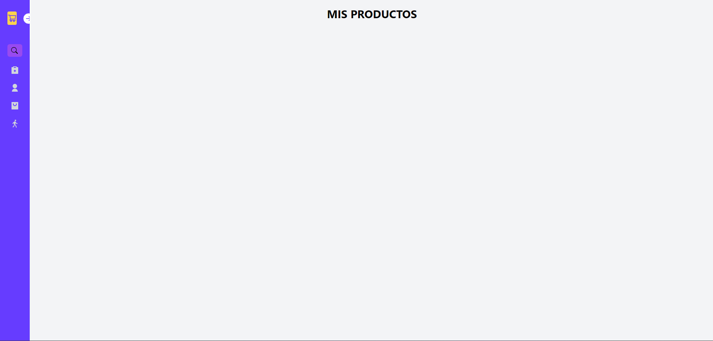
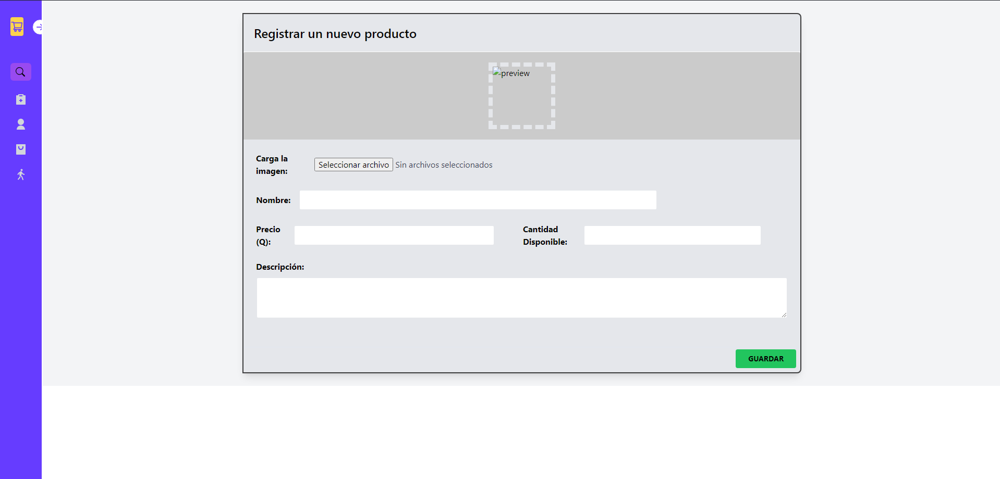
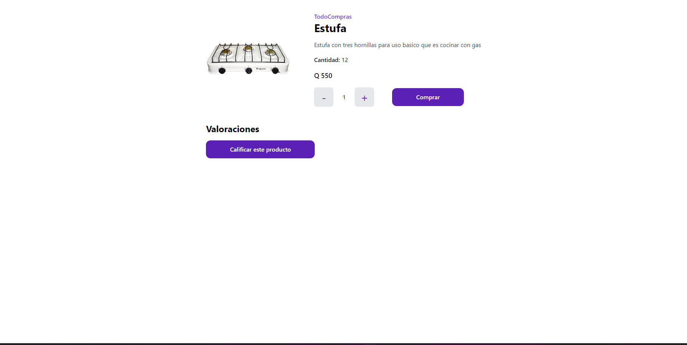
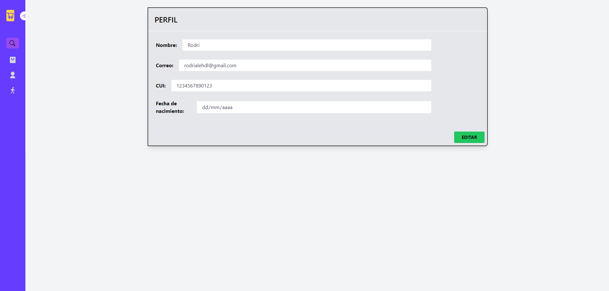
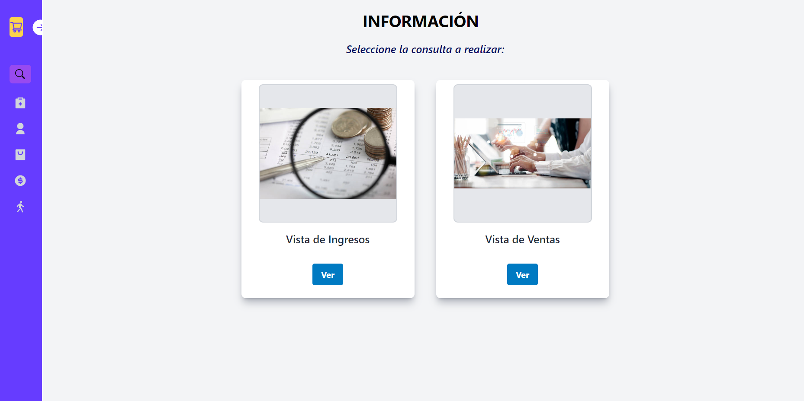
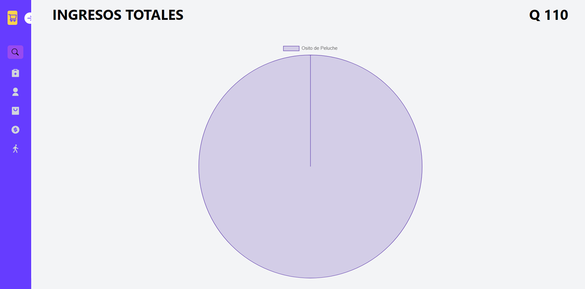
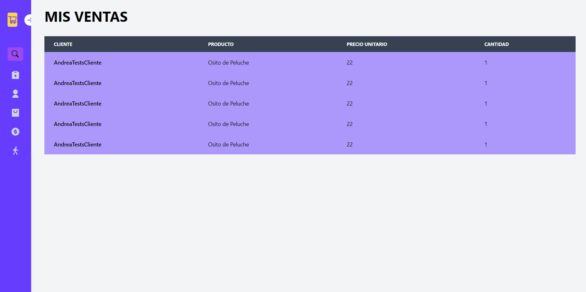
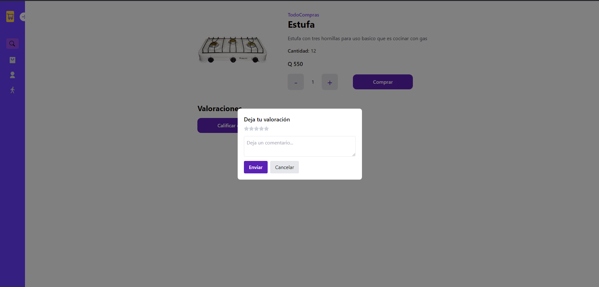
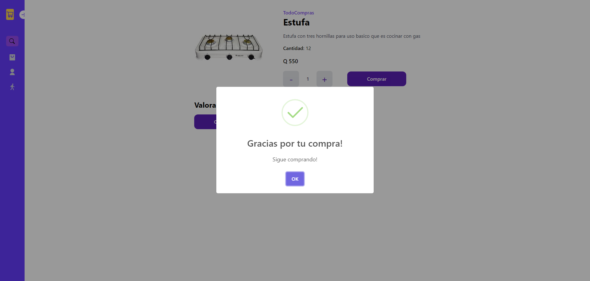

# Manual de Usuario

## Navegación

1. Al ingresar a la aplicación se encontrará con la pantalla de inicio, en la cual se le solicitará que inicie sesión o se registre.

## Login

1. Para iniciar sesión, deberá ingresar su correo electrónico y contraseña.

## Registro

Para registrarse, deberá ingresar:
- Nombre
- Correo Electrónico
- Contraseña
- CUI
- Año de nacimiento
- Rol (Cliente o Vendedor)

## Usuario Tipo Vendedor:
1. Usted ya logueado como usuario tipo vendedor podrá realizar lo que es:
    - Visualizar sus productos
    - Crear Productos
    - Visualizar detalle de algún producto en específico.
    - Visualizar su perfil.
    - Visualizar consultas.

Para tener una mejor guía de esto, siga las siguientes secciones del manual:

### Visualizar productos
Esta opción será su página default al iniciar sesión, por lo que bastará con que ingrese sus datos correctos y aparecerá la siguiente pantalla:

### Crear Productos
Una vez iniciada la sesión, deberá dirigirse por la sidebar izquierda a la opción correspondiente. Se le mostrará el formulario de producto donde podrá:
- Ingresar imagen
- Nombre de producto
- Precio del producto
- Stock del producto
- Descripción del producto

 
Y para visualizar los cambios, guardarlos.

### Visualizar detalle de producto
Igualmente, esta opción podrá usted utilizarla solamente con iniciar sesión ya que se encuentra en la misma ubicación que visualizar productos. Usted deberá de dar click en el botón correspondiente y el detalle de su producto se mostrará:

### Visualizar Perfil
Esta opción se encuentra en la sidebar izquierda, una vez ingresa a esta, los datos de su perfil cargarán automaticamente.

## Consultas
Un vendedor puede realizar dos tipos de consultas: 

- Vista de ingresos: Se visualizarán los ingresos obtenidos de las ventas realizadas.

- Vista de Ventas: Se visualizarán las ventas realizadas.

## Valoraciones

En esta sección se encuentra en la vista de detalle de producto, donde podrá visualizar las valoraciones de los clientes y agregar una valoración.

### Agregar Valoración
Para agregar una valoración, deberá de dar click en el votón de valorar este producto, y se le mostrará un formulario donde podrá ingresar la valoración y un comentario hacia el producto.

### Actualizar Valoración
Para actualizar una valoración, deberá de dar click en el botón de editar valoración, y se le mostrará un formulario donde podrá actualizar la valoración y el comentario hacia el producto.

### Eliminar Valoración
Para eliminar una valoración, deberá de dar click en el botón de eliminar valoración, y se le mostrará un mensaje de confirmación para eliminar la valoración.

## Comprar Producto
Para comprar un producto, deberá de dar click en el botón de comprar producto.

