# 💻 Proyecto
```json
{
  "Curso": "Analisis y Diseño de Sistemas 2",
  "Sección": "B",
  "Periodo": "Primer Semestre 2024",
  "Actividad": "Proyecto"
}
```

## Grupo 2
| Carnet | Nombre |
| ------ | ------ |
| [`201900042`](https://github.com/rodrialeh01) | Rodrigo Alejandro Hernández De León | 
| [`201901604`](https://github.com/BelenContrerasOrozco) | Ana Belén Contreras Orozco |
| [`201901772`](https://github.com/DanielDubonDR) | Daniel Reginaldo Dubón Rodríguez |
| [`202004745`](https://github.com/Allenrovas) | Allen Giankarlo Román Vásquez |
| [`202010918`](https://github.com/AndreaCabrera01) | Andrea María Cabrera Rosito |
---
# <center> **MarketPlace**  </center>
   
## **Descripción del negocio**


 Una tienda online donde estará lo que es 1 administrador, vendedores o clientes. En esta, el administrador podrá gestionar los demás roles y el sitio en general. Por otro lado, los vendedores tendrán la opción de vender productos y los demás comprarlos. Igualmente, para demostrar la calidad de los productos de mencionados vendedores, los clientes podrán dejar reseñas sobre estos – también, los clientes podrán tener lo que es un carrito de compras para mantener control sobre sus compras.

   - **Antecedentes del proyecto**
    <br>
    Debido al creciente auge de la tecnología, y visto que la manera en que se manejan las compras en linea, se puede observar que la manera de compras, de cualquier tipo de articulos, ya es un poco anticuada a lo que respecta al ir a los lugares y comprar los articulos en ese lugar.
    <br>


 # <center> Modelo Branching </center>
### GitFlow

---
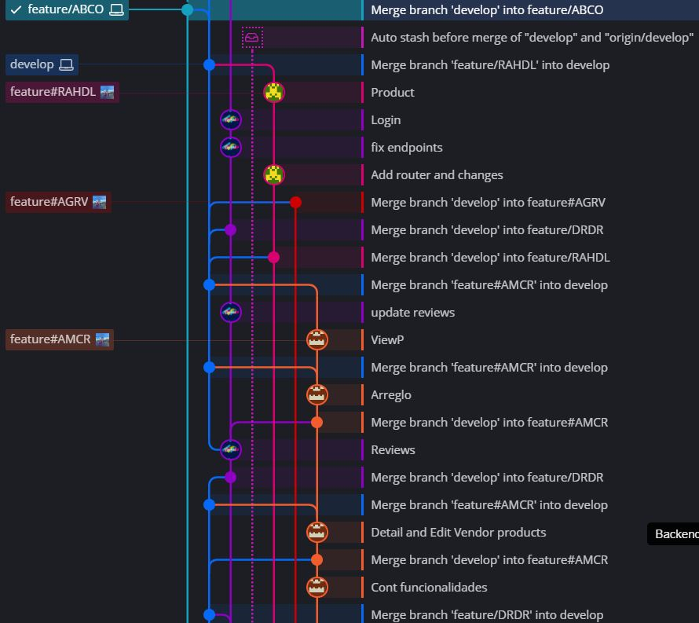
---

### Proceso de creación de flujo

> Main

La rama Main se crea por defecto al crear el repositorio del proyecto. En ella se hicieron varios commits con el fin de subir todo lo necesario para iniciar el proyecto. Al tener ya versiones en producción actualizamos la rama develop para que el siguiente desarrollador tuviera la ultima versión a trabajar y pudiera fusionarla con su rama.

___Crear proyecto -> Main___

> Develop

La rama develop se crea desde la rama main. En esta rama se fusionan las nuevas funcionalidades y modificaciones que elaboro cada desarrollador.

___Main -> Develop___

> Feature

Las rama feature se crean desde la rama develop. En total se hicieron 5 ramas feature, una para cada desarrollador, estas ramas se cada vez que se utilizaron se tenían que actualizar desde la develop, al agregar las funcionalidades y terminar subir los cambios en dicha rama, se fusionan con la rama develop.

___Develop -> Feature/x -> Develop___

> Release

Las rama release se crean desde la rama develop, las utilizamos para crear las nuevas versiones del software.

___Develop -> Release/x.y.z___

> Tag

Los tag se crean desde la rama main, los utilizamos para marcar las nuevas versiones de lanzamiento para uso de los usuarios.

___Release/x.y.z -> Main -> x.y.z (Tag)___

# Mockups
## Vendedor

### Registro de Productos
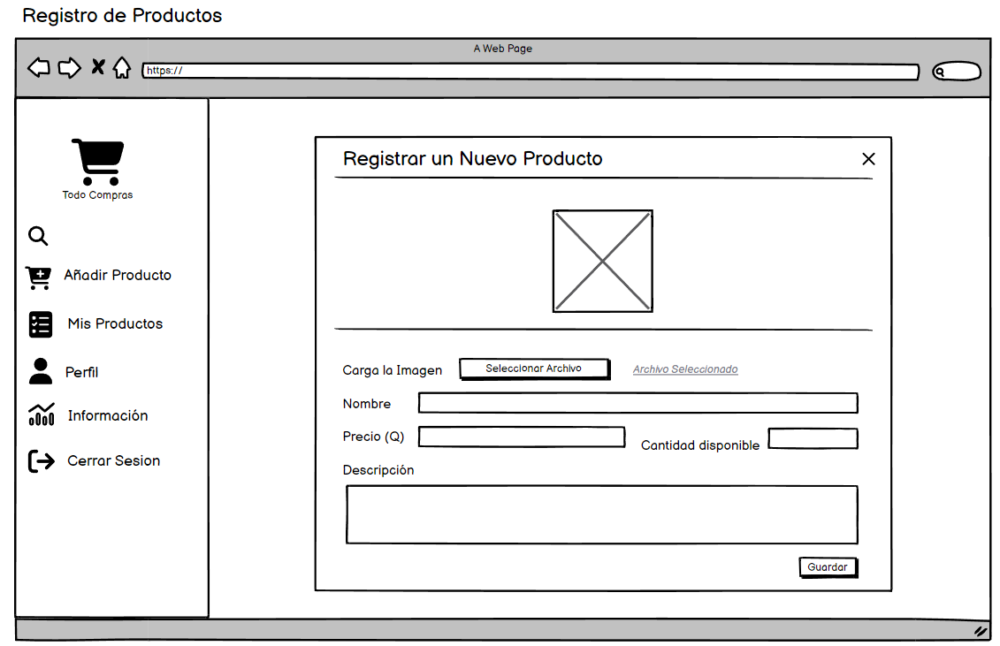
### Vista de Productos
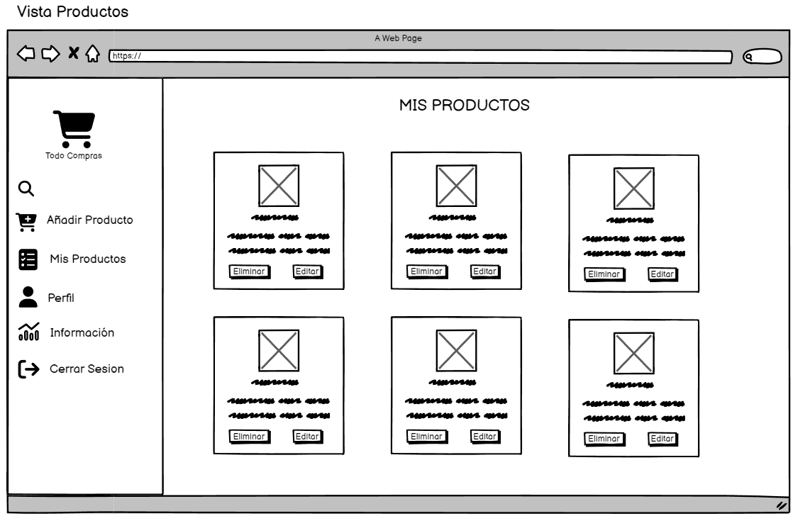
### Edición de Productos
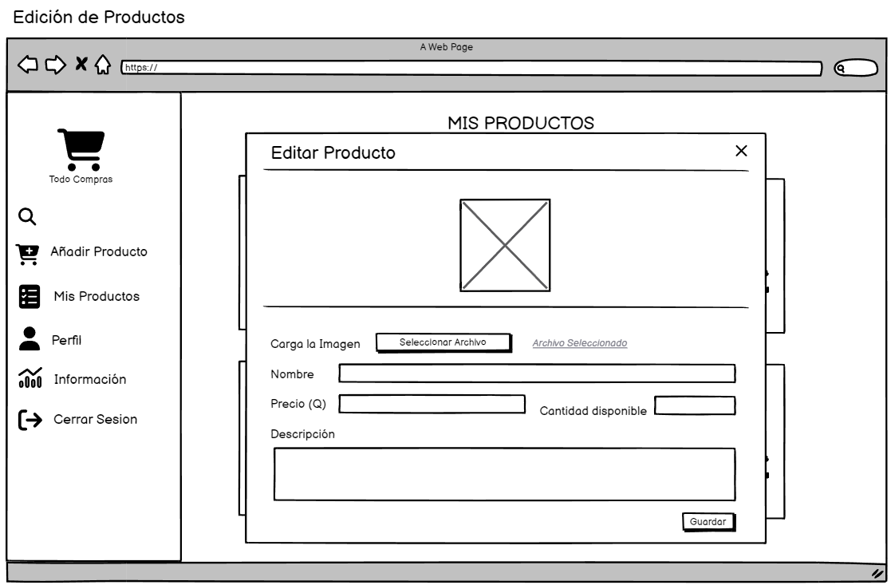
### Vista de Perfil
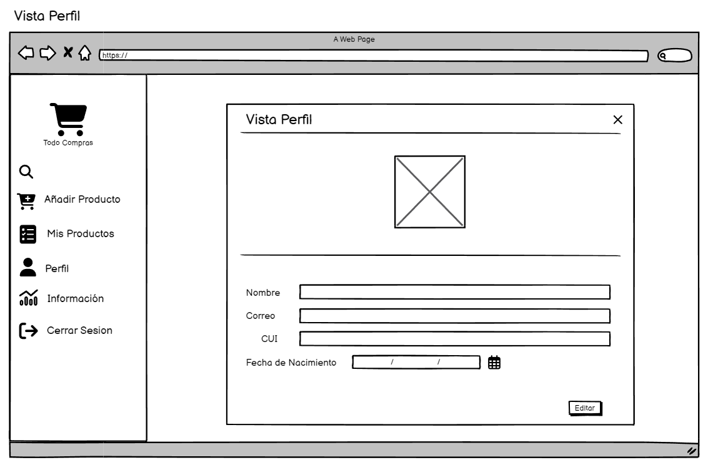
### Información
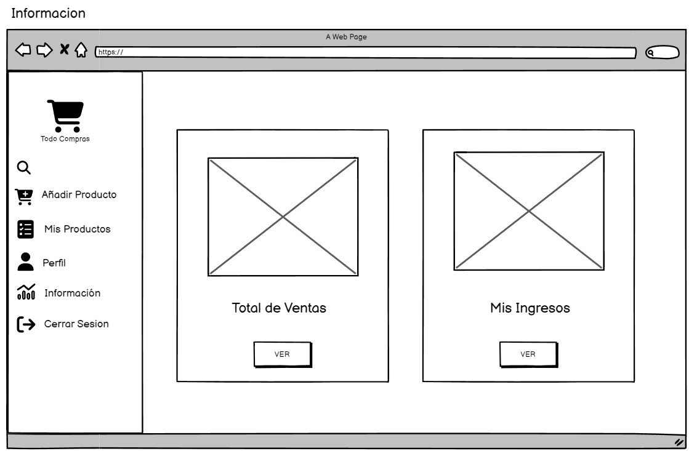
### Vista de Ventas
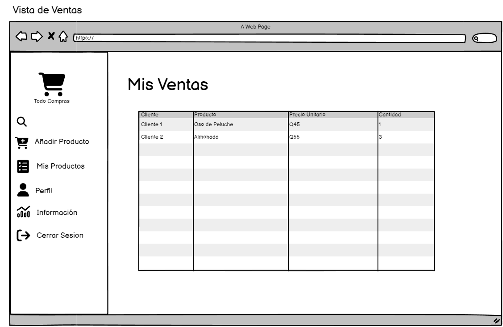
### Vista de Ingresos
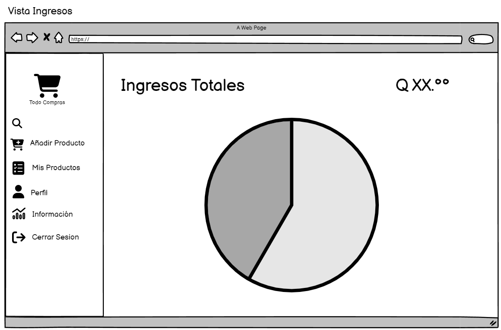


## Usuario


## Administrador

### Reporte de Ventas en un rango determinado de tiempo
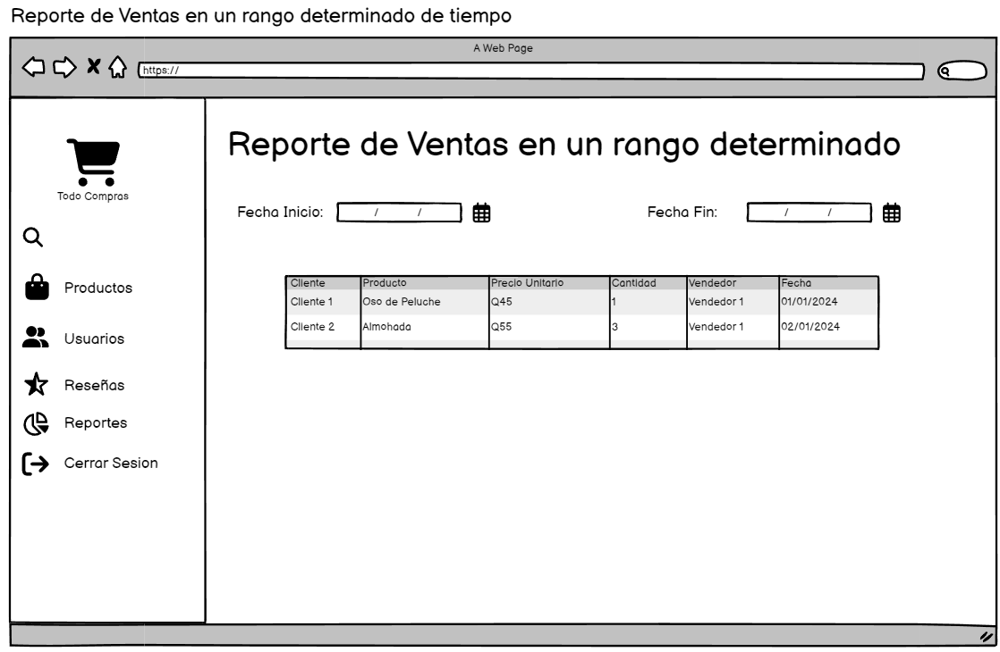


# Arquitectura
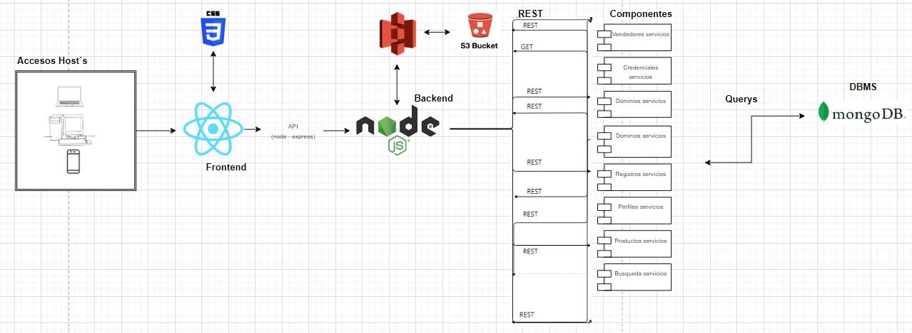

La arquitectura nos muestra que la aplicación podrá ser accedidad desde cualquier dispositivo con acceso a internet.
La parte visual, o FrontEnd, se realizó en React, que estará consumiendo la Api o BackEnd realizado en NodeJs.
El BackEnd consumirá los servicios de S3 y RDS de AWS, el cual contendrá el Bucket y la base de datos de MongoDB, respectivamente, de todo el servicio.

Al centro podemos visualizar todas las peticiones que se realizarán por parte del Front hacia el Back y este a la base de datos por medio de querys. 


# Diagrama de Patrones

## Diagrama UML (clases)
Muestra como están todas las clases y qué detalles tienen, como atributos, funciones y sus propiedades.

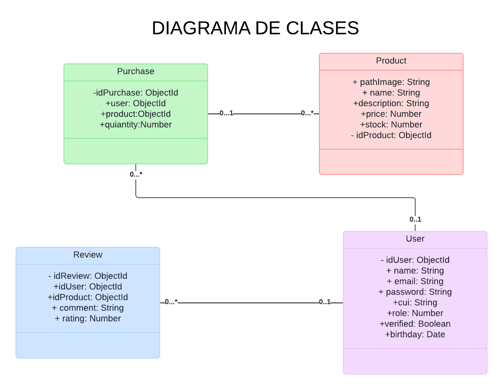

## Diagrama de Componentes
El diagrama de componentes muestra los servicios del proyecto y como están interconectados.
Así como los servicios que van a estar en cada uno de ellos.

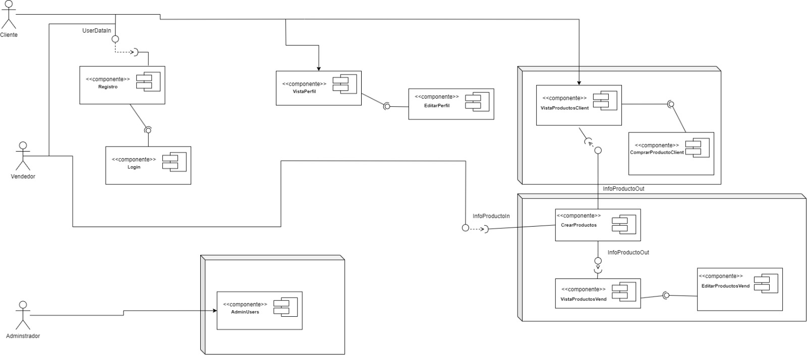

## Diagrama de Despliegue

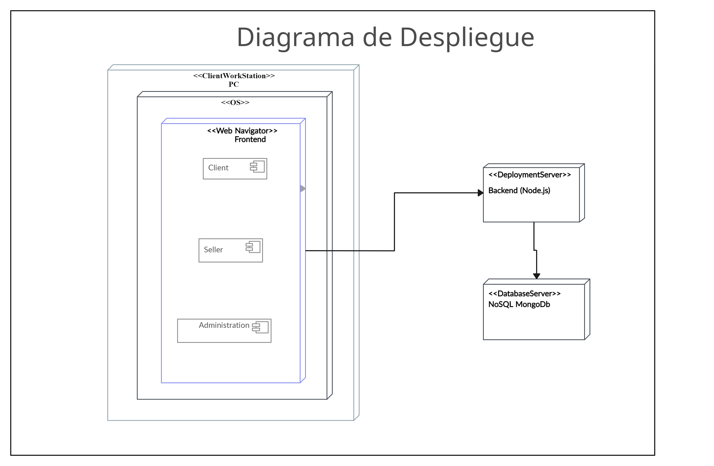

## Diagrama Patrones

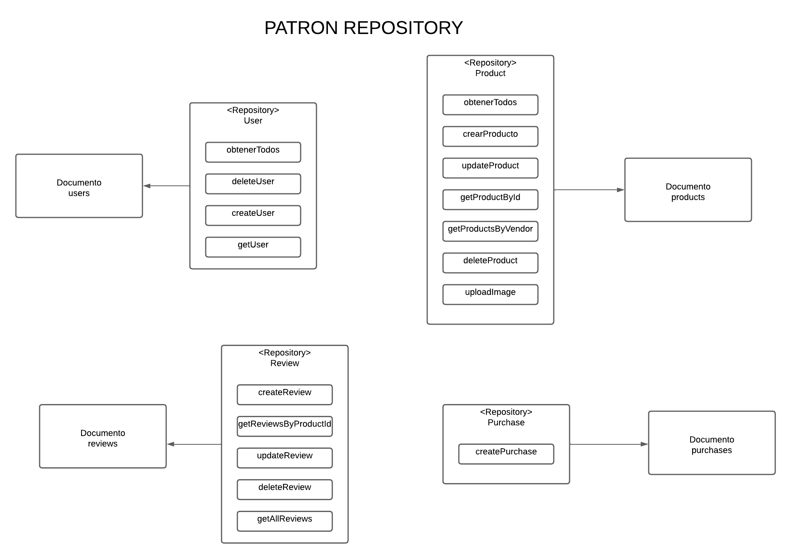
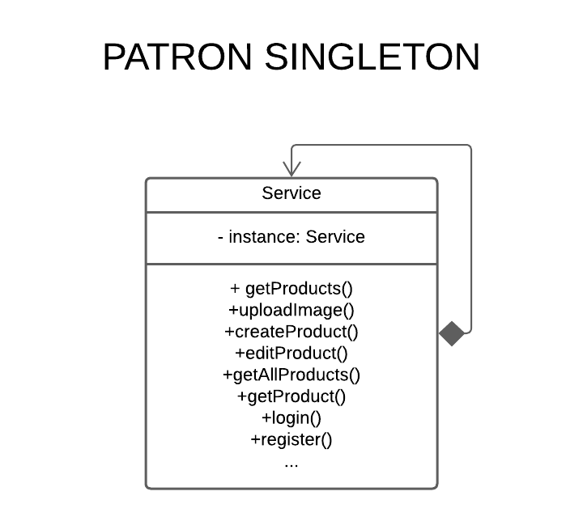

# Diagrama Entidad Relación
El siguiente diagrama es una representacion de la entidad relacion que se utilizara para la base de datos que se empleara en el proyecto.

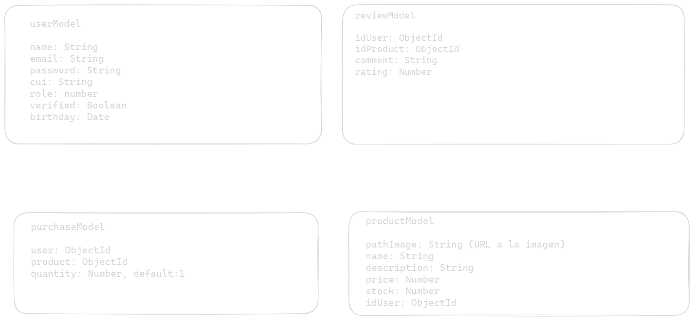


# <center> Puntos de Historia </center>
<br>

## Prioridad 5
- Módulo Empresa

| Historia: Despliegue del módulo empresarial | Prioridad: 5 |
|--------------------------------------------|--------------|
| **Tarea: Acceso al sistema**               | **Prioridad: 5** |
| **Descripción:** Los usuarios empresariales pueden acceder al sistema mediante el login del registro. Al ingresar al módulo de empresa, se visualizan todos los registros asociados a la empresa, incluyendo descripción, puntos de partida y destino, precios, capacidad y categoría. |
| **Criterios de aceptación:** 
- Los usuarios empresariales pueden iniciar sesión.
- Al ingresar al módulo de empresa, se muestran todos los registros asociados a la empresa.

| Historia: Despliegue del módulo empresarial | Prioridad: 5 |
|--------------------------------------------|--------------|
| **Tarea: Registro de productos**           | **Prioridad: 5** |
| **Descripción:** Los vendedores pueden registrar nuevos productos en la plataforma. |
| **Criterios de aceptación:** 
- Los vendedores pueden acceder al formulario de registro de productos.
- El formulario solicita detalles del producto, como nombre, descripción, precio, etc.
- Al enviar el formulario, el producto se registra y aparece en la plataforma.

## Prioridad 4
- Módulo Cliente

| Historia: Consultar productos disponibles | Prioridad: 4 |
|------------------------------------------|--------------|
| **Tarea: Consultar productos**            | **Prioridad: 4** |
| **Descripción:** Los clientes pueden ver la lista de productos disponibles en la plataforma. |
| **Criterios de aceptación:** 
- Los clientes pueden acceder al módulo de búsqueda o a la sección de productos.
- Se muestra una lista de productos con detalles como nombre, precio, y categoría.

| Historia: Modulo cliente                   |              |
|-------------------------------------------|--------------|
| **Tarea: Validación de consultas**         | **Prioridad: 4** |
| **Descripción:** Los clientes pueden realizar consultas sobre productos y precios. |
| **Criterios de aceptación:** 
- Los clientes pueden realizar consultas de productos según criterios como categoría o precio.
- Los resultados de las consultas se presentan de manera clara y legible.

## Prioridad 3
- Módulo Perfil del Usuario

| Historia: Visualizar y editar perfil       | Prioridad: 3 |
|-------------------------------------------|--------------|
| **Tarea: Visualizar perfil**               | **Prioridad: 3** |
| **Descripción:** Los usuarios pueden ver la información de su perfil, como nombre, dirección, etc. |
| **Criterios de aceptación:** 
- Los usuarios pueden acceder a la sección de perfil.
- Se muestra la información del perfil del usuario.

| **Tarea: Editar perfil**                   | **Prioridad: 3** |
| **Descripción:** Los usuarios pueden editar la información de su perfil. |
| **Criterios de aceptación:** 
- Los usuarios pueden acceder a la sección de edición de perfil.
- Se proporciona un formulario para editar la información del perfil.

## Prioridad 2
- Módulo Administrador

| Historia: Administrador control total | Prioridad: 2 |
|--------------------------------------|--------------|
| **Tarea: Control total de la plataforma** | **Prioridad: 2** |
| **Descripción:** El administrador tiene control total sobre la plataforma. Puede gestionar usuarios, productos, y revisar reseñas. |
| **Criterios de aceptación:** 
- El administrador puede acceder a un panel de control exclusivo.
- Puede gestionar usuarios (crear, editar, eliminar).
- Puede gestionar productos (crear, editar, eliminar).
- Puede revisar y moderar reseñas de productos.

| Historia: Módulo de Reseñas         | Prioridad: 2 |
|-------------------------------------|--------------|
| **Tarea: Reseñas de productos**     | **Prioridad: 2** |
| **Descripción:** Los usuarios pueden dejar reseñas sobre los productos que han comprado. |
| **Criterios de aceptación:** 
- Los usuarios pueden acceder al módulo de reseñas.
- Pueden dejar reseñas para productos.
- Pueden ver las reseñas dejadas por otros usuarios.

## Prioridad 1
- Módulo de Venta

| Historia: Detalles del producto     | Prioridad: 1 |
|-------------------------------------|--------------|
| **Tarea: Ver detalles del producto** | **Prioridad: 1** |
| **Descripción:** Los usuarios pueden ver detalles específicos de un producto, incluyendo descripción, precio, y reseñas. |
| **Criterios de aceptación:** 
- Los usuarios pueden hacer clic en un producto para ver detalles adicionales.
- Se muestra una página detallada con información del producto.

| Historia: Compra de productos       | Prioridad: 1 |
|-------------------------------------|--------------|
| **Tarea: Realizar compra**           | **Prioridad: 1** |
| **Descripción:** Los usuarios pueden agregar productos al carrito y realizar compras. |
| **Criterios de aceptación:** 
- Los usuarios pueden agregar productos al carrito desde la página de detalles del producto.
- Pueden proceder a la compra desde el carrito.
- Se realiza la compra y se genera un recibo.

<br>
<br>

# <center> Historias de usuario / criterios de aceptación. </center>
<br>

## **Módulo de Usuario**
-  **Ingreso al módulo “administrador ó root”**
  
    El root le fue asignado el rol de administrador del sitio de servicios de viajes bus guatemala el cual tendrá a cargo diversas  tareas y funciones dentro del sitio. Para poder acceder a todas estas funciones y llevar a cabo su rol como administrador el “root” debe pasar por el proceso de seguridad del sitio, que valide que el tenga los **permisos** para acceder a este módulo.
    
    El “root” debe loguearse para validar sus datos y poder tener acceso al módulo de administrador. Para ello debe ingresar su correo electrónico o nombre de usuario y contraseña que fueron registrados en la base de datos que lo acreditan como administrador del sitio.
    
    Al validarse que los datos ingresados son correctos el sitio redirigirá al módulo de administración a “root” para la página de quien presta servicios corporativos, empresariales, locales, festivos en distintas líneas de servicio de clases en cada bus según lo solicitado por la app web.
    
- **Ingreso al módulo de usuario**
  
  Un cliente que juega el rol de usuario como cliente de la aplicacion podrá tener acceso a la informacion sobre los productos disponibles, sus productos comprados, su perfil.

  Para tener acceso a su información el cliente debe loguearse para validar sus datos y poder tener acceso al módulo de servicios. Para ello debe ingresar su correo electrónico o nombre de usuario y contraseña con el que el  administrador del sitio la  registró en el sitio.

    Al validarse que los datos ingresados son correctos el sitio redirigirá al módulo de servicios.
    
- **Recuperación o cambio de contraseña**
  
  Un usuario que juega un rol dentro de la aplicacion y se encuentra registrado en el nuevo sitio de compras, ha olvidado su contraseña para ingresar al sitio.

    Al darle clic sobre el enlace de recuperar contraseña, el usuario deberá ingresar su nombre de usuario o correo con el que está registrado en el sitio para recibir el enlace en el correo electrónico que le permita a el usuario cambiar de contraseña.

    Al ingresar a su correo y entrar al enlace el usuario ingresa su nueva y contraseña y con ello podrá ingresar a su perfil en el sistema.
   

- **Página principal e ingreso a módulos de acceso público**
  
  Si una persona particular tiene el interés de conocer más acerca de un producto que se encuentra dentro de la plataforma y validar que se tiene disponible, su precio y descripcion.

  Ahora tiene la oportunidad de tener acceso de una manera más accesible a esta información y la de otros casos. Para ello debe ingresar al nuevo sitio de MarketPlace y podrá tener acceso a distinta información de acceso público de la aplicación.
    

## **Módulo de Empresa**
- **Registro de vendedor y productos disponibles en la plataforma**

    Una persona en particular ha notado que las personas en la actualidad compran mas por internet y ulitilizar las aplicacion de MarketPlace para realizar dicha acción. 


- **Busqueda de productos**

    Realizar sus opracion en la misma, y se desea ver los detalles de los productos que se desean adquirir o ya se compraron, dentro de la pagina. 

    Al ingresar al apartado de busqueda y colocar el nombre del producto a la venta de mostraran todos los productos que esten relaciondados con la busqueda, en dicha pagina se mostraran los productos y en ellos su discripcion.


# Herramienta de gestion de proyectos
## **Github**
Github, ademas de ser una plataforma en la que se coparte el codigo es una plataforma de gestión de proyectos en línea que utiliza tarjetas y tableros para organizar tareas y colaborar en equipo. Permite a los usuarios visualizar el progreso de proyectos, asignar tareas y establecer plazos de manera intuitiva y flexible.

### ***Tablero***
Se utilizó un tablero en Trello en dónde se manjaron los bloques de Desarrollo, QA, y Develop.
Cada tarea dentro de los bloques tendrá su descripción y se mostrará si está terminado, en proceso o por empezar.


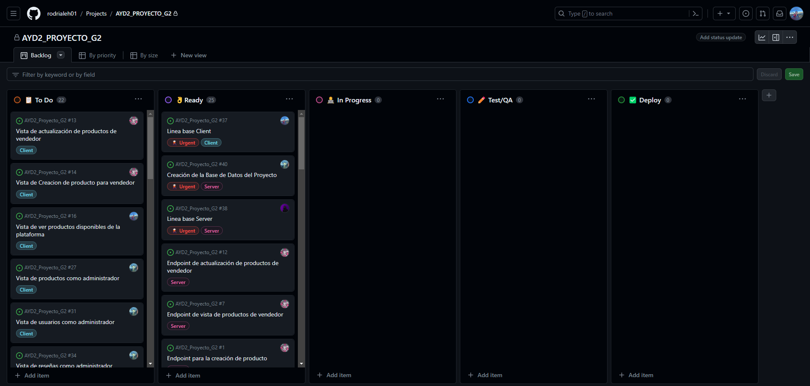


# SPRINTS

 - Para cada sprint se hicieron 4 reuniones
   - Sprint Planning: para planificar qué es lo que se hará dentro de este propio spring, entre las cuales se define el tablero y las tasks que se realizarán
   - Daily Meeting: para revisar que es lo que se ha estado haciendo en el transcurso de la última reunión, o si se tienen problemas dudas, y en general qué se hará para ayudarse o continuar en el trabajo.
   - Sprint Restrospective: Para especificar qué fue lo que se hizo en todo el sprint, y verificar qué problemas hubo para no volverlos a repetir en los próximos, qué se retrasó, etc...

# Carpeta de grabaciones

https://drive.google.com/drive/folders/19KI0_pRhudytaUeb5BBmW-vgGPIHD1rX?usp=sharing
