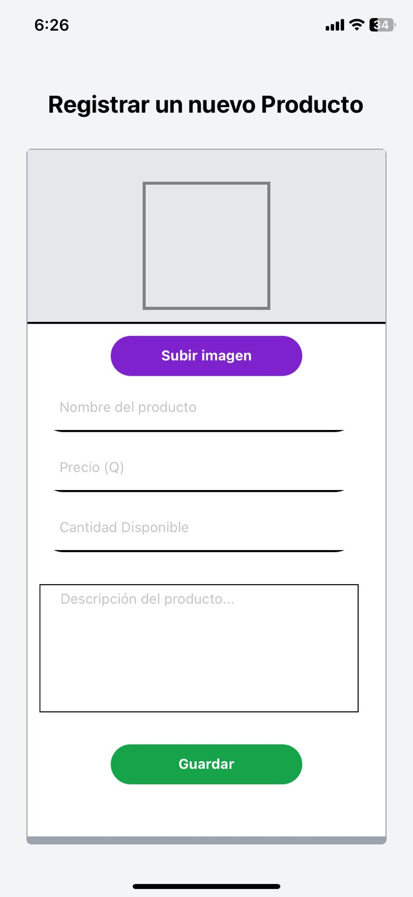
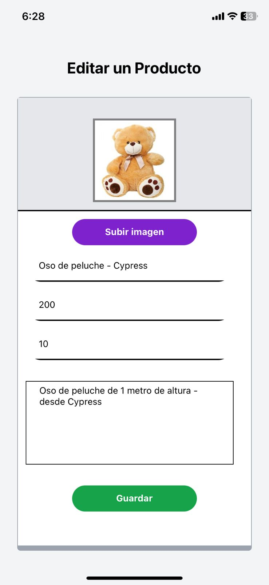

# MANUAL DE USUARIO

## 1. Funcionalidades - Usuario tipo Vendedor
Para el usuario tipo vendedor, se le permite:
- Visualizar sus productos.
- Agregar productos.
- Modificar productos.
- Visualizar reporte de ventas (Ingresos).

### 1.1 Visualizar productos
Es la página inicial con la que el vendedor se encontrará al ingresar al sistema. En ella se visualizan los productos que el vendedor tiene en su inventario. Cada producto cuenta con un botón de "Editar" que permite modificar el producto. Igualmente, podrán verse los botonos de "Agregar nuevo producto" y "Reporte de Ventas".

 

### 1.2 Agregar productos
Para agregar un producto, el vendedor deberá hacer clic en el botón "Agregar producto" en la página de visualización de productos. Se le redirigirá a una página donde podrá ingresar los datos del producto. Al finalizar, deberá hacer clic en el botón "Agregar" para guardar el producto.

 

### 1.3 Modificar productos
Para modificar un producto, el vendedor deberá hacer clic en el botón "Editar" del producto que desea modificar. Se le redirigirá a una página donde podrá modificar los datos del producto. Al finalizar, deberá hacer clic en el botón "Guardar" para guardar los cambios.
 

Los campos que se pueden modificar son:
- Imagen del producto
- Nombre del producto
- Precio del producto
- Cantidad del producto (Stock)
- Descripción del producto

 

### 1.4 Visualizar reporte de ventas

El reporte de ventas se refiere a un reporte en gráfica de Pie que muestra los ingresos que ha tenido el vendedor en base a sus productos vendidos. Para visualizar el reporte, el vendedor deberá hacer clic en el botón "Reporte de Ventas" en la página de visualización de productos.

 

