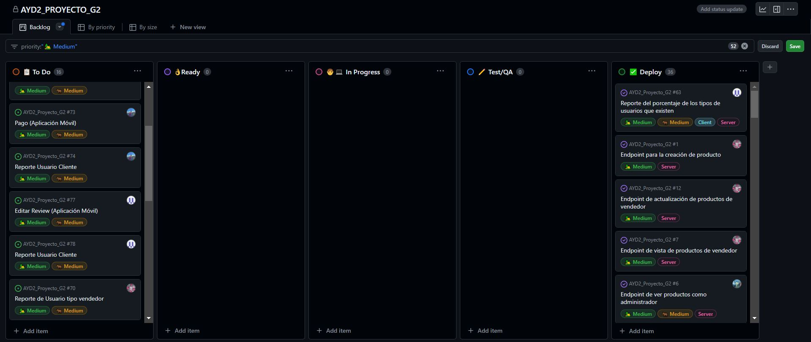
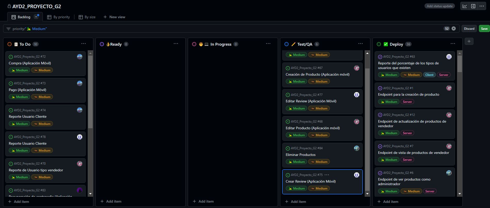
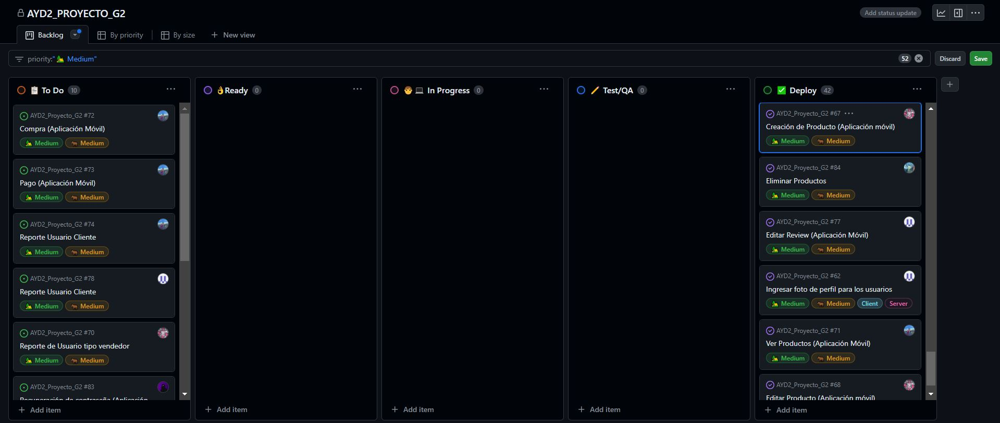
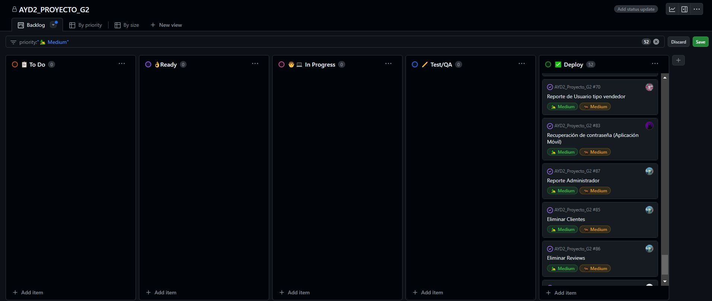

# 💻 Proyecto
```json
{
  "Curso": "Analisis y Diseño de Sistemas 2",
  "Sección": "B",
  "Periodo": "Primer Semestre 2024",
  "Actividad": "Proyecto"
}
```

## Grupo 2
| Carnet | Nombre |
| ------ | ------ |
| [`201900042`](https://github.com/rodrialeh01) | Rodrigo Alejandro Hernández De León |
| [`201901604`](https://github.com/BelenContrerasOrozco) | Ana Belén Contreras Orozco |
| [`201901772`](https://github.com/DanielDubonDR) | Daniel Reginaldo Dubón Rodríguez |
| [`202004745`](https://github.com/Allenrovas) | Allen Giankarlo Román Vásquez |
| [`202010918`](https://github.com/AndreaCabrera01) | Andrea María Cabrera Rosito |
---
# <center> **Documentación Sprint**  </center>
   
## **Primer Sprint**
### Sprint planning


#### Tablero Kanban



Lo que se planeó para que trabajara en el sprint:
**Rodrigo Hernandez:**
- Ver productos (Todos/Individual)
- Compra

**Belén Contreras:**
- Crear Review
- Eliminar Review

**Daniel Dubón**
- Registro
- Login

**Allen Román**
- Eliminar Productos
- Eliminar Usuarios

**Andrea Cabrera**
- Creación de Producto
- Editar Producto
- E2E (7 Pruebas)
- 1 Reporte Usuario Vendedor

### Daily 1
**Rodrigo Hernandez:**
- En que se trabajo: Se integraron cambios anteriores al repositorio
- En se trabajara: Se dividirán las tareas necesarias para esta fase
- Algun inconveniente: Ninguno


**Belén Contreras:**
- En que se trabajo: Se seleccionaron las funcionalidades para la esta fase
- En se trabajara: Se priorizaran las tareas
- Algun inconveniente: Ninguno


**Daniel Dubón**
- En que se trabajo: Se realizaron cambios en el bucket
- En se trabajara: Se iniciara con el login
- Algun inconveniente: Ninguno


**Allen Román**
- En que se trabajo: Se inicio con la vista para eliminar productos
- En se trabajara: Se continuara con la vista para eliminar productos
- Algun inconveniente: Ninguno


**Andrea Cabrera**
- En que se trabajo: Se trabajó con la configuración inicial de Cypress para las pruebas E2E.
- En se trabajara: La primera prueba E2E.
- Algun inconveniente: No se encontraron inconvenientes.

### Daily 2
**Rodrigo Hernandez:**
- En que se trabajo: Se priorizaron las tareas
- En se trabajara: Se iniciara con la vista para poder der los todos los productos
- Algun inconveniente: Ninguno


**Belén Contreras:**
- En que se trabajo: Se inicio a trabajar con la vista para crear una reseña a un producto
- En se trabajara: Se continuara a trabajar en la vista para crear una reseña
- Algun inconveniente: Ninguno


**Daniel Dubón**
- En que se trabajo: Se inicio a trabajar en la vista para ingresar (login)
- En se trabajara: Se continuara trabajando para realizar el ingreso correcto
- Algun inconveniente: Ninguno


**Allen Román**
- En que se trabajo: Se continuara con la eliminacion de productos 
- En se trabajara: Se continuara con la eliminarcion de productos
- Algun inconveniente: Ninguno


**Andrea Cabrera**
- En que se trabajo: Se inició con la primera prueba E2E - Login Correcto.
- En se trabajara: Continuar con la primera prueba E2E.
- Algun inconveniente: No se encontraron inconvenientes.

### Daily 3
**Rodrigo Hernandez:**
- En que se trabajo: Se continuara con la visualizacion de todos los productos
- En se trabajara: Se terminara la visualización de todos los productos
- Algun inconveniente: Ninguno


**Belén Contreras:**
- En que se trabajo: Se continuo con la vista para relizar las reseñas de productos
- En se trabajara: Se terminara la vista para dejar una reseña
- Algun inconveniente: Ninguno


**Daniel Dubón**
- En que se trabajo: Se termino el login
- En se trabajara: Se realizaran las primeras pruebas en el login de la app
- Algun inconveniente: Ninguno


**Allen Román**
- En que se trabajo: Se continua trabajando en la eliminacion de productos como administrador
- En se trabajara: Se terminara la opcion de eliminar productos 
- Algun inconveniente: Ninguno


**Andrea Cabrera**
- En que se trabajo:  Se finalizó la primera prueba E2E - Login Correcto e igualmente, se inició y terminó la 2da prueba E2E - Login Incorrecto.
- En se trabajara:  Continuar con las pruebas E2E.
- Algun inconveniente: No se encontraron inconvenientes.

### Daily 4
**Rodrigo Hernandez:**
- En que se trabajo: Se termino la vista en donde estaran todos los productos disponibles
- En se trabajara: Se iniciara con la parte de ver los productos de manera individual
- Algun inconveniente: Ninguno


**Belén Contreras:**
- En que se trabajo: Se tiene lista la opcion de crear una reseña
- En se trabajara: Se iniciar con la opcion de eliminar una reseña
- Algun inconveniente: No se ha podido probar dejar una reseña ya que aun no existe la vista individual 


**Daniel Dubón**
- En que se trabajo: Se inicio con la vista para el formulario de registro de un  nuevo usuario
- En se trabajara: Se continuara con el formulario para un nuevo usuario
- Algun inconveniente: Ninguno


**Allen Román**
- En que se trabajo: Se termino la eliminacion de productos 
- En se trabajara: Se iniciara en la eliminacion de usuarios
- Algun inconveniente: No se ha podido probar eliminar un producto ya que aun no existe la vista individual 


**Andrea Cabrera**
- En que se trabajo: Se inició con la 3era prueba E2E - El registro de un producto correctamente.
- En se trabajara: Continuar con las pruebas E2E.
- Algun inconveniente: Hubieron problemas en la parte de codificación de la prueba, pero se logró solucionar.


### Daily 5
**Rodrigo Hernandez:**
- En que se trabajo: Se continua con la vista para los productos de manera individual
- En se trabajara: Se terminaran las vista para los productos de manera individual 
- Algun inconveniente: Ninguno


**Belén Contreras:**
- En que se trabajo: Se continua trabajando en la opcion de poder eliminar un reseña
- En se trabajara: Se terminara la eliminacion de una reseña
- Algun inconveniente: Ninguno


**Daniel Dubón**
- En que se trabajo: Se continua con el trabajo para realizar un nuevo registro
- En se trabajara: Se terminara la opcion de registro
- Algun inconveniente: Ninguno


**Allen Román**
- En que se trabajo: Se continua trabajando en la opcion de eliminar usuarios
- En se trabajara: Se terminara la opcion 
- Algun inconveniente: ninguno


**Andrea Cabrera**
- En que se trabajo:  Se finalizó la 3era prueba E2E - El registro de un producto correctamente e igualmente, se inició con la 4ta prueba E2E - El dejar una review de un producto.
- En se trabajara:  Terminar la 4ta prueba E2E y continuar con las pruebas restantes.
- Algun inconveniente: No se encontraron inconvenientes.


### Daily 6
**Rodrigo Hernandez:**
- En que se trabajo: Se termino la vista de producto de manera invidual
- En se trabajara: Se iniciara la opcion de compra
- Algun inconveniente: Ninguno


**Belén Contreras:**
- En que se trabajo: se termino la opcion de eliminar reseña
- En se trabajara: Se inicio la prueba de dejar una reseña
- Algun inconveniente: Ninguno


**Daniel Dubón**
- En que se trabajo: Se termino la opcion del registro
- En se trabajara: Se iniciaran pruebas para realizar un nuevo registro
- Algun inconveniente: Ninguno


**Allen Román**
- En que se trabajo: Se termino la opcion de eliminar usuarios
- En se trabajara: Se haran las pruebas para eliminar productos 
- Algun inconveniente: ninguno


**Andrea Cabrera**
- En que se trabajo: Se finalizó la 4ta prueba E2E - El dejar una review de un producto e igualmente, se inició con la 5ta prueba E2E - el dejar un producto en el carrito.
- En se trabajara: Finalizar la 5ta prueba E2E y continuar con las pruebas restantes.
- Algun inconveniente: Hubieron problemas en la parte de codificación de la prueba.


### Daily 7
**Rodrigo Hernandez:**
- En que se trabajo: Se continua con la opcino de realizar compra
- En se trabajara: Se terminara la opcino de realizar compra
- Algun inconveniente: Ninguno


**Belén Contreras:**
- En que se trabajo: Se termino de realizar la prueba de dejar reseña en un un producto
- En se trabajara: Se tratara de eliminar una reseña 
- Algun inconveniente: ninguno


**Daniel Dubón**
- En que se trabajo: Se registraron nuevos usuarios exitosamente
- En se trabajara: Se intentara ingresar con los nuevos usuarios
- Algun inconveniente: ninguno


**Allen Román**
- En que se trabajo: Se logro eliminar productos
- En se trabajara: Se intentara trabajar en la prueba de eliminar usuarios
- Algun inconveniente: Ninguno


**Andrea Cabrera**
- En que se trabajo: Se solucionaron los problemas de las pruebas anteriores y se inició y terminó la 6ta prueba E2E - La eliminación de un producto por parte de un usuario tipo 'Admin'.
- En se trabajara: La última prueba E2E.
- Algun inconveniente: No se encontraron inconvenientes.


### Daily 8
**Rodrigo Hernandez:**
- En que se trabajo: Se termino la opcion de realizar compra
- En se trabajara: Se haran pruebas para comprar
- Algun inconveniente:Ninguno


**Belén Contreras:**
- En que se trabajo: Se terminaron las pruebas de esta spring
- En se trabajara: Se iniciara con la documentacion 
- Algun inconveniente: ninguno


**Daniel Dubón**
- En que se trabajo: Se logro ingresar de manera exitosa con los nuevos usuarios
- En se trabajara: Inicio de documentacion
- Algun inconveniente: Ninguno


**Allen Román**
- En que se trabajo: Se terminaron las pruebas de esta spring
- En se trabajara: Se iniciara con la documentacion 
- Algun inconveniente: ninguno


**Andrea Cabrera**
- En que se trabajo: Se inició y terminó la última prueba E2E - La edición de un producto por parte de un usuario tipo 'Vendedor'.
- En se trabajara: Se empezará a trabajar en la documentación del proyecto.
- Algun inconveniente: No se encontraron inconvenientes.


### Sprint Retrospective


#### Tablero Kanban



**Rodrigo Hernandez:**
- ¿Qué se hizo bien durante el Sprint?:
  - LLegar a la meta las tareas.
  - Hubo comunicación constante.
-  ¿Qué se hizo mal durante el Sprint?:
    - No tomar en cuenta el tiempo arreglos en el bucket.
    - Tiempos de atraso en el desarrollo del proyecto.
- ¿Qué mejoras se deben implementar para el próximo sprint?:
  - Organizar las tareas que sean de mayor prioridad.
  - Tomar en cuenta las tareas que dependen de otras para su desarrollo.


**Belén Contreras:**
- ¿Qué se hizo bien durante el Sprint?:
  - Comunicación entre los compañeros dentro y fuera del daily.
  - Conocer las herramientas para el desarrollo del proyecto.
- ¿Qué se hizo mal durante el Sprint?:
  - No preguntar a tiempo las dudas que se tenían.
- ¿Qué mejoras se deben implementar para el próximo sprint?:
  - Mejorar la comunicación.


**Daniel Dubón**
- ¿Qué se hizo bien durante el Sprint?:
  - Contar con lineas base para el desarrollo del proyecto.
  - Comunicación constante en los dailys para el desarrollo de actividades.
- ¿Qué se hizo mal durante el Sprint?:
  - Depender de bastante tiempo de espera para el desarrollo de sus actividades.
- ¿Qué mejoras se deben implementar para el próximo sprint?:
  - Tomar en cuenta las tareas que dependen de otras para su desarrollo.
  - Priorizar las tareas que sean de mayor importancia.


**Allen Román**
- ¿Qué se hizo bien durante el Sprint?:
  - Comunicación entre los compañeros dentro y fuera del daily.
- ¿Qué se hizo mal durante el Sprint?:
  - No tomar en cuenta el flujo de trabajo para el desarrollo de os endpoints.
- ¿Qué mejoras se deben implementar para el próximo sprint?:
  - Tomar en cuenta las tareas que dependen de otras para su desarrollo.
  - Mejorar la comunicación.


**Andrea Cabrera**
- ¿Qué se hizo bien durante el Sprint?:
    - Se logró finalizar a tiempo las pruebas E2E.
    - Existió comunicación constante entre los miembros del equipo.
-  ¿Qué se hizo mal durante el Sprint?:
    - Aunque se terminó a tiempo, el manejo del tiempo no fue el mejor.
- ¿Qué mejoras se deben implementar para el próximo sprint?:
    - Mejorar el manejo del tiempo.
    - Mejorar la comunicación entre los miembros del equipo.

## **Segundo Sprint**


### Sprint planning


#### Tablero Kanban



Lo que se planeó que se trabajara durante el sprint


**Rodrigo Hernandez:**
- Pago
- 1 Reporte Usuario Cliente
- Documentación

**Belén Contreras:**

- Editar Review
- 1 Reporte Usuario Cliente
- Documentación

**Daniel Dubón**
- Recuperar Contraseña
- Documentación

**Allen Román**
- Eliminar Reviews
- Reporte Admin
- Documentación

**Andrea Cabrera**
- Terminar las funcionalidades restantes para la app móvil.
- Terminar documentación del proyecto.

### Daily 1
**Rodrigo Hernandez:**
- En que se trabajo: Se terminara de probar la compra
- En se trabajara: De iniciara la opcion de pago de la compra
- Algun inconveniente: Ninguno


**Belén Contreras:**
- En que se trabajo: Se inicio la opcion de editar la reseña
- En se trabajara: Se continuara con el diseño del formulario para editar la reseña
- Algun inconveniente: ninguno


**Daniel Dubón**
- En que se trabajo: Se inicio con la opcion de recuperar contraseña en el inicio se sesion
- En se trabajara: Se continuara con dicha opcion 
- Algun inconveniente: ninguno


**Allen Román**
- En que se trabajo: Se inicio con la opcion de eliminar reseña por parte de un adminstrador
- En se trabajara: se continuara con dicha opcion 
- Algun inconveniente: ninguno


**Andrea Cabrera**
- En que se trabajo: Se empezó a conocer el ambiente de trabajo para la app móvil.
- En se trabajara: Empezar a dar funcionalidades a la app móvil.
- Algun inconveniente: Se dificultó al principio el manejo de la app móvil, react native y android studio.

### Daily 2
**Rodrigo Hernandez:**
- En que se trabajo: Se continuara con la opcion de realizar pago por tarjeta
- En se trabajara: Se terminara dicha opcion y se probara
- Algun inconveniente: ninguno


**Belén Contreras:**
- En que se trabajo: se continua trabajando en la opcion de editar la reseña
- En se trabajara: se intentara editar una reseña
- Algun inconveniente: ninguna


**Daniel Dubón**
- En que se trabajo: se continua trabajando en el envio de correo para recuperar contraseña
- En se trabajara: se encriptara la contraseña para la recuperacion
- Algun inconveniente: ninguno


**Allen Román**
- En que se trabajo: se termino la seccion de eliminar una reseña como administrador
- En se trabajara: se hara la prueba para eliminar una reseña y mostrar los cambios
- Algun inconveniente: ninguno


**Andrea Cabrera**
- En que se trabajo: Se empezó a trabajar en la app móvil. Primeramente la parte cliente en el listado de los productos de vendedor.
- En se trabajara: Se continuará con la app móvil.
- Algun inconveniente: Se dificultó al principio la sintaxis de React Native.

### Daily 3
**Rodrigo Hernandez:**
- En que se trabajo: Se continua trabajando con la opcion de realizar pago con sus opciones
- En se trabajara: Empezar a probar el pago reflejado
- Algun inconveniente: ninguno


**Belén Contreras:**
- En que se trabajo: se terminaron las pruebas para crear, editar y eliminar reseña como cliente
- En se trabajara: se iniciar el primer reporte que los usuarios podran ver
- Algun inconveniente: ninguno


**Daniel Dubón**
- En que se trabajo: Se logro mandar correo para la recuperación de contraseña
- En se trabajara: Se comprobara que las contresañas se encriptaron para su recuperación
- Algun inconveniente: ninguno


**Allen Román**
- En que se trabajo: Se inicio con el reporte de los administradores
- En se trabajara: Se continuara trabajando en los reportes
- Algun inconveniente: ninguno


**Andrea Cabrera**
- En que se trabajo: Se continuó con la app móvil. Se trabajó en la parte de cliente en la visualización del formulario de creación de un producto.
- En se trabajara: Continuar con la app móvil. 
- Algun inconveniente: No se encontraron inconvenientes.


### Daily 4
**Rodrigo Hernandez:**
- En que se trabajo: Se logro realizar el pago de manera exitosa
- En se trabajara: Se trabajara en la pantalla en la que se mostrara el pago exitoso
- Algun inconveniente: ninguno


**Belén Contreras:**
- En que se trabajo: Se decicio de que tratara el reporte de cliente
- En se trabajara: Se iniciar a trabajar en el reporte que veran los clientes
- Algun inconveniente: ninguno


**Daniel Dubón**
- En que se trabajo: Se iniciaron las pruebas para recuperar la contraseña
- En se trabajara: Se continuaran las pruebas para recuperar la contraseña
- Algun inconveniente: ninguno


**Allen Román**
- En que se trabajo: Se decidio de que iba a mostrar el reporte del administrador
- En se trabajara: Se iniciar la recuperación de datos para el reporte
- Algun inconveniente: ninguno


**Andrea Cabrera**
- En que se trabajo: Se terminó con la vista del formulario de creación de un producto en la app móvil. Se continuó con la vista del formulario de edición de un producto.
- En se trabajara: Continuar con la vista de edición de un producto.
- Algun inconveniente: Ninguno.


### Daily 5
**Rodrigo Hernandez:**
- En que se trabajo: Se termino toda la programacion necesaria para realizar y mostrar con exito el pago
- En se trabajara: Se inicio con el segundo reporte que vera el usuario tipo cliente
- Algun inconveniente: ninguno


**Belén Contreras:**
- En que se trabajo: se termino la recuperacion de datos para el reporte de usuario
- En se trabajara: terminar el reporte de lo usuarios
- Algun inconveniente: ninguno


**Daniel Dubón**
- En que se trabajo: Se realizaron las pruebas de manera exitosa para recuperar la contraseña
- En se trabajara: Se iniciara con la documentacion de esta fase
- Algun inconveniente:


**Allen Román**
- En que se trabajo: Se obtuvieron de manera exitosa los datos necesarios para el reporte de los usuarios tipo administradores
- En se trabajara: Se terminara la vista del reporte
- Algun inconveniente: ninguno


**Andrea Cabrera**
- En que se trabajo: Se empezó a agregar funcionalidades a las vistas creadas, principalmente en la vista de edición de un producto.
- En se trabajara: Terminar de agregar funcionalidades a las vistas.
- Algun inconveniente: Se dificultó la implementación de subida de imágenes al bucket de S3 - por lo que gran cantidad de tiempo se invirtió en esto.


### Daily 6
**Rodrigo Hernandez:**
- En que se trabajo: se termino la recuperacion de datos para el reporte de los clientes
- En se trabajara: terminar el reporte de los clientes
- Algun inconveniente: ninguno


**Belén Contreras:**
- En que se trabajo: Se termino el reporte de clientes respecto a las reseñas
- En se trabajara: Se continuo con la documentacion y apoyar en las pruebas generales
- Algun inconveniente: ninguno


**Daniel Dubón**
- En que se trabajo: Se apoyo a los demas compañeros en tareas pendientes y bloqueos 
- En se trabajara: Se continuara con la documentacion pentiende 
- Algun inconveniente: ninguno


**Allen Román**
- En que se trabajo: Se termino con la vista para el reporte de los administradores
- En se trabajara: Se iniciara con la documentacion y probar el flujo de la aplicacion y sus funcionalidad correcta
- Algun inconveniente:


**Andrea Cabrera**
- En que se trabajo: Se arregló la subida de imágenes al bucket de S3 y se continuó con la implementación de las funcionalidades de las vistas. Se terminó la vista de edición de un producto y se agregó la funcionalidad de creación de un producto por completo.
- En se trabajara: Realizar el reporte de vendedor.
- Algun inconveniente: No se encontraron inconvenientes.


### Daily 7
**Rodrigo Hernandez:**
- En que se trabajo: Se termino la vista del reporte de usuario tipo cliente
- En se trabajara: Se iniciara con la documentacion pendiente de la fase
- Algun inconveniente: Ninguno


**Belén Contreras:**
- En que se trabajo: Se apoyo a compañeros con tareas pendientes y pruebas iniciales
- En se trabajara: Se terminara la documentación pendiente
- Algun inconveniente:Ninguno


**Daniel Dubón**
- En que se trabajo: Se realizo la integracion final del proyecto
- En se trabajara: Documentacion final
- Algun inconveniente: Ninguno


**Allen Román**
- En que se trabajo: Se apoyo a compañeros con tareas pendientes y pruebas iniciales
- En se trabajara: Se terminara la documentación pendiente
- Algun inconveniente:Ninguno


**Andrea Cabrera**
- En que se trabajo: Se agregó la vista y funcionalidad de reporte de vendedor.
- En se trabajara: Documentación e integración final del proyecto.
- Algun inconveniente:  No se encontraron inconvenientes.


### Daily 8
**Rodrigo Hernandez:**
- En que se trabajo: Apoyo en la integración y pruebas finales
- En se trabajara: 
- Algun inconveniente: Niguno


**Belén Contreras:**
- En que se trabajo: Se realizo la actulizacion de la documentacion
- En se trabajara: 
- Algun inconveniente: Ninguno


**Daniel Dubón**
- En que se trabajo: Apoyo en la documentacion y pruebas
- En se trabajara: 
- Algun inconveniente: Ninguno


**Allen Román**
- En que se trabajo: Se termino la documentación pendiente
- En se trabajara: 
- Algun inconveniente: Ninguno


**Andrea Cabrera**
- En que se trabajo: Se terminó la integración final del proyecto y documentación.
- En se trabajara: --
- Algun inconveniente: No se encontraron inconvenientes. 


### Sprint Retrospective


#### Tablero Kanban



**Rodrigo Hernandez:**
- ¿Qué se hizo bien durante el Sprint?: 
  - La información compartida en las Daily fueron útil para el avance de todos en conjunto, tomando en consideración las prioridades que se requerían.
-  ¿Qué se hizo mal durante el Sprint?: 
  - Realización tarde de los diagramas que hubieran ahorrado flujo de trabajo.
- ¿Qué mejoras se deben implementar para el próximo sprint?: 
  - Manejo de mejor manera el Kanban y realización del documento al inicio.


**Belén Contreras:**
- ¿Qué se hizo bien durante el Sprint?: 
  - Sentir el apoyo de los compañeros de trabajo en dado caso alguno tuviera algún problema en la realización del mismo.
- ¿Qué se hizo mal durante el Sprint?: 
  - Priorización y documentación tardía, se necesita trabajar desde inicio e irlos actualizando según necesidades.
- ¿Qué mejoras se deben implementar para el próximo sprint?: 
  - Ir actualizando a las demás personas de mejor manera el progreso, ya sea en el Daily, en el tablero Kanban o en algún otro medio de comunicación.


**Daniel Dubón**
- ¿Qué se hizo bien durante el Sprint?: 
  - Organizar de mejor manera, ya que habían componentes que dependían de otros y se mejoró la comunicación.
-  ¿Qué se hizo mal durante el Sprint?: 
  - No llevar la documentación a la mano.
- ¿Qué mejoras se deben implementar para el próximo sprint?: 
  - Notificar cambios por los demás compañeros, así no se pasa por alto cambios que pueden afectar a los demás.


**Allen Román**
- ¿Qué se hizo bien durante el Sprint?: 
  - Saber como afrontar los desafíos, abordando los problemas en equipo.
- ¿Qué se hizo mal durante el Sprint?: 
  - Mal repartimiento en el flujo de trabajo.
- ¿Qué mejoras se deben implementar para el próximo sprint?: 
  - Trabajar más escalonadamente, buscando las prioridades altas hacerlas de primero.


**Andrea Cabrera**
- ¿Qué se hizo bien durante el Sprint?:
    - Se logró finalizar a tiempo lo planeado.
    - Existió comunicación constante entre los miembros del equipo.
-  ¿Qué se hizo mal durante el Sprint?:
    - Falta de lectura, lo que provocó problemas en la implementación de la subida de imágenes al bucket de S3. Luego de leer la documentación, se logró solucionar.
- ¿Qué mejoras se deben implementar para el próximo sprint?:
    - Mejorar el manejo del tiempo.