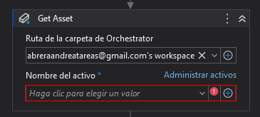
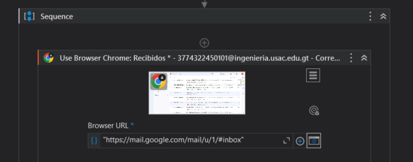

# Practica

# Manual Técnico

# 📱 Proyecto
```json
{
  "Curso": "Analisis y Diseño de Sistemas 2",
  "Sección": "B",
  "Periodo": "Primer Semestre 2024",
  "Actividad": "Proyecto"
}
```

## Grupo 2
| Carnet | Nombre |
| ------ | ------ |
| [`201900042`](https://github.com/rodrialeh01) | Rodrigo Alejandro Hernández De León | 
| [`201901604`](https://github.com/BelenContrerasOrozco) | Ana Belén Contreras Orozco |
| [`201901772`](https://github.com/DanielDubonDR) | Daniel Reginaldo Dubón Rodríguez |
| [`202004745`](https://github.com/Allenrovas) | Allen Giankarlo Román Vásquez |
| [`202010918`](https://github.com/AndreaCabrera01) | Andrea María Cabrera Rosito |
---

# Manual Técnico

## 📚 Contenido

- [Practica](#practica)
- [Manual Técnico](#manual-técnico)
- [📱 Proyecto](#-proyecto)
  - [Grupo 2](#grupo-2)
  - [| `202010918` | Andrea María Cabrera Rosito |](#-202010918--andrea-maría-cabrera-rosito-)
- [Manual Técnico](#manual-técnico-1)
  - [📚 Contenido](#-contenido)
  - [Introducción](#introducción)
  - [Objetivos](#objetivos)
  - [Funcionamiento UiPath](#funcionamiento-uipath)
    - [Orquestador](#orquestador)
    - [Página PNC](#página-pnc)
    - [Página Villa Nueva](#página-villa-nueva)

## Introducción

Este manual técnico tiene como objetivo explicar el funcionamiento de los procesos automatizados realizados en UiPath, los cuales se encargan de extraer información de las páginas web de la PNC y de la Municipalidad de Villa Nueva.

## Objetivos

- Extraer información de las páginas web de la PNC y de la Municipalidad de Villa Nueva desde la busqueda de placas en la lectura de un archivo de excel.
- Almacenar la información extraída en una excel.

## Funcionamiento UiPath

### Orquestador

El orquestador es el encargado de guardar datos sensibles y datos dinámicos como:
- Rutas de archivos.
- Nombres de archivos.
- Usuarios y contraseñas.

### Página PNC

1. Abre google chrome con la [Página SAT de Multas](https://portal.sat.gob.gt/portal/multas/)


2. Se un delay de 3 segundos para que cargue la página.
3. Del orquestador se agarra la variable de la carpeta donde se leerá el archivo de entrada y donde se guardará el archivo de salida.
4. Crea el archivo excel de salida.
5. Escribe los encabezados en el archivo de salida.

  | No. Placa | Lugar a Pagar | Valor total | Estado |
  | --------- | ------------- | ----------- | ------ |
6. Obtiene la variable del nombre del archivo de entrada.
7. Lee el archivo de entrada.
8. Lo guarda en una variable de tipo DataTable.
9. Lee cada columna del DataTable.
10. Una vez ingresado el número de placa, se da click en el botón de consultar multa.
    
    

11. Al darle click en el botón de consultar multa, se obtiene la información de la multa, en este caso se verifica si existe multa o no. Esto se realiza validando con un Element Exist, donde se obtiene la información *"No Existen Remisiones"*.

    

12. Se escriben los datos en el excel sobre la placa que se consultó. En este escribe el tipo de placa y la institucion donde se esta consultando y se debe pagar la multa que en este caso es la PNC.

    
    

13. Si existe el texto *"No Existen Remisiones"*, se escribe en el excel en la columna de Estado *"Free"* y en la columna de Valor total *"Q0.00"*.
    

14. Si no existe el texto *"No Existen Remisiones"*, significa que si hay multa y se obtiene la información de la multa, en este caso se obtiene el valor total a pagar, esto se hace con un Get Attribute. Posteriormente se escribe en el excel en la columna de Valor total el valor obtenido y en la columna de Estado *"Busted"*.
    
    

15. Se da click en el botón de limpiar para limpiar la información de la placa consultada y poder ingresar una nueva placa y se repite el proceso hasta que se terminen de consultar todas las placas del archivo de entrada.

    

### Página Antigua Guatemala

1. Abre google chrome con la [Página SAT de Multas](https://portal.sat.gob.gt/portal/multas/)


2. Se un delay de 3 segundos para que cargue la página en donde se buscara el numero de placa.


3. Del orquestador se agarra la variable de la carpeta donde se leerá el archivo de entrada y donde se guardará el archivo de salida.



4. Crea el archivo excel de salida.


5. Escribe los encabezados en el archivo de salida.

    | No. Placa | Lugar a Pagar | Valor total | Estado |
    | --------- | ------------- | ----------- | ------ |


6. Obtiene la variable del nombre del archivo de entrada y lee el archivo de entrada.


7. Lo guarda en una variable de tipo DataTable.


8. Hace un scroll hasta encontrar el elemento que representa a la municipalidad de Antigua Guatemala y le da click a Multas Antigua Guatemala.


9. Lee cada columna del DataTable.


10. Para cada fila de la tabla hace el siguiente proceso:

- 10.1 Se guardan las variables de estado del Row. Donde contadorGlobal es el contador de placas entre los dos sitios utilizados; contadorRow es el contador en que fila se encuentra del archivo e Ind es el mismo contador pero en string para poder escribirlo en el .xlsx.


- 10.2 Selecciona el tipo de placa de esa fila y también lo guarda en una variable tipoTemp y escribe en el input el número de placa.


- 10.3 Le da clic en buscar a la placa.


- 10.4 Obtiene el valor a pagar, lo guarda en una variable y luego le aplica una regular expresión para quedarnos con el valor como un número real.


- 10.3 Guarda con el div la existencia o no de multas.


- 10.6 Escribe en el excel de salida la placa y el lugar de procedencia de la búsqueda.


- 10.7 Si la variable Existencia es verdadera significa que no tiene multas y es anotado en el archivo .xlsx de salida, mientras si es falsa es anotada la multa con el total a pagar.


### Envío de Correos

Una vez ya obtenido el archivo de salida con la información de las multas, se envía un correo con el archivo de salida adjunto. Para este proceso:

1. Se ingresa a Google Chrome, se abre el correo de Gmail y, ya que la sesión está iniciada con anterioridad, se procede a redactar un correo.
<br>
  - Se abre Google Chrome.



  - Se obtienen los assets necesarios desde el orquestrador (ruta del archivo de salida y el correo a enviar).


2. Se ingresa el correo al que se enviará el archivo de salida, el asunto y el cuerpo del correo.
  - Se ingresa como texto el correo al que se enviará el archivo de salida.
  - Se ingresa el asunto del correo.
  - Se ingresa el cuerpo del correo.


3. Se adjunta el archivo de salida con la ruta obtenida y se le da un delay de 5s para que cargue el correo.
  


4. Se envía el correo.
  


### Ejemplo de Correo que recibirá el destinatario:


### Ejemplo de archivo de entrada:


### Ejemplo de archivo de salida final:

